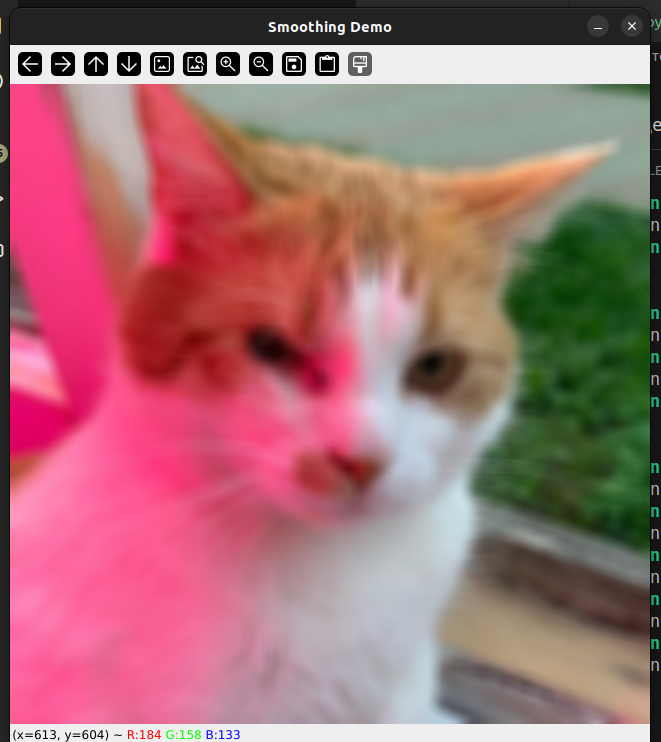
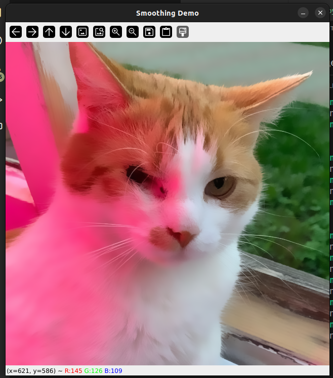

# Лабораторная 2

Здесь также просто идет запуск уже готовых в opencv функций, ниже представлено примерное описание каждого из используемых алгоритмов

### Homogeneous Blur

Данный алгоритм является самым простым из рассматриваемых. Значение каждого пикселя вычисляется как среднее соседствующих с ним пикселей ("соседствующие" пиксели определяются выбранным kernel-ом). Чем больше kernel (3x3, 5x5, 9x9 и т.д.), тем соответственно сильнее размытие

### Gaussian Blur

В данном алгоритме идея эволюционирует и теперь в kernel-матрице пиксели имеют разный "вес", который соответствует нормальному распределению (т.е чем ближе пиксель к вычисляемому, тем больше у него вес).

### Median Blur

Медианное размытие представляет собой почти то же, что и Homogeneous Blur, но вместо среднего значения берет медианное. Данный фильтер часто используется для удаления шумов.

## Пример запуска

```
python3 main.py cat.jpg
```

### Homogeneous



### Gaussian


### Median

