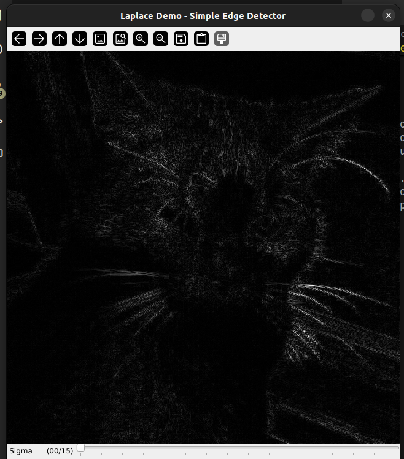
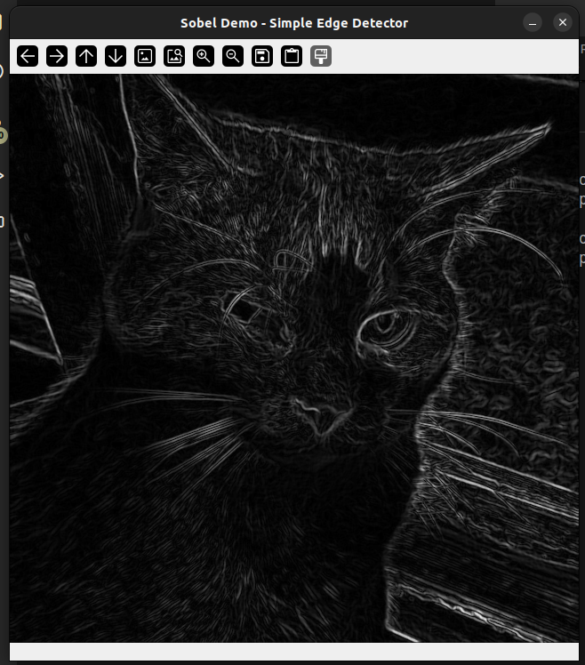
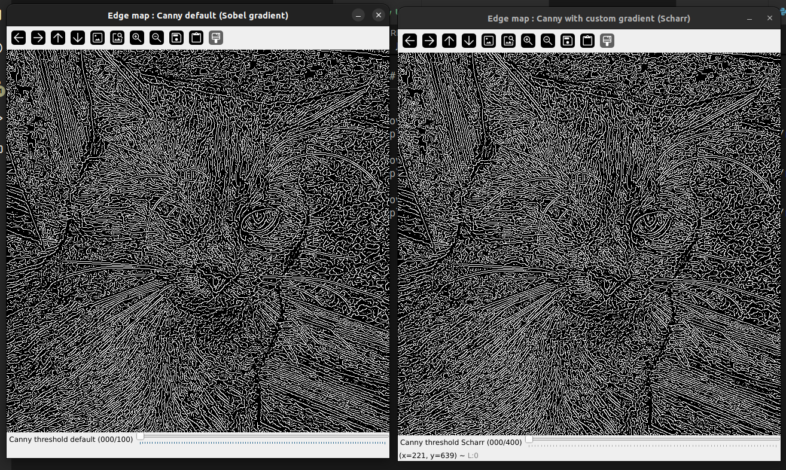
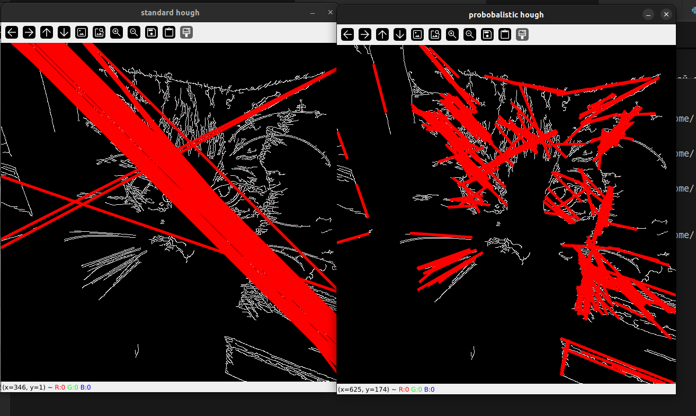
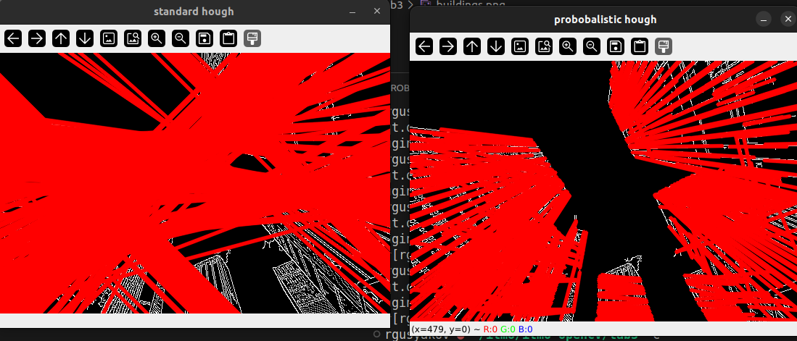

# Лабораторная 3

## Выделение границ методом Лапласа

Так как при выделение границ нам нужны только "основные" границы, то перед тем как использовать метод Лапласа, полезно размыть изначальное изображение, что можно сделать одним из методов предложенных в лабораторной 2.

После размытия же применяется метод Лапласа, который заключается в использовании второй производной функции, которая в свою очередь выражает "насыщенность" (intensity) каритнки. Для лучших результатов используется не цветная картинка в ее изначальной форме, а ее черно-белая версия (что лучше выражает интенсивность). Производная же вычисляется с помощью специального kernel-а. Например, вот матрица при размере kernel-а 3x3:

```
[ 0 -1  0]
[-1  4 -1]
[ 0 -1  0]
```

## Выделение границ оператором Собеля

В отличии от алгоритма Лапласа, Собель использует две производные первого порядка: одна в направлении x, другая в y. Таким образом данный метод может быть достаточно быстр, но и груб при высокочастотных колебаниях в изображении.

Для вычисление производных, при свертывании используются следующие матрицы (для размера kernel-а 3x3):

```
    [-1  0  1]
x = [-2  0  2]
    [-1  0  1]

    [ 1  2  1]
y = [ 0  0  0]
    [-1 -2 -1]
```

## Выделение границ оператором Кэнни

Данный алгоритм похож на предыдущие два, но включает в себя несколько этапов:

- Поиск градиентов: при котором используется 4 различных фильра, так как нужные градиенты могут иметь раздчные направления (например 0, 45, 90, 135 градусов).
- Подавление немаксимумов: при котором границы отмечаются только локальные максимумы.
- Двойная пороговая фильтрация: при которой потенциальные границы определяются "порогами".
- Трассировка области неоднозначности: при которой итоговые границы определяются путём подавления всех краёв, не связанных с определенными (сильными) границами.

В результате данный алгоритм достигает следующих целей:
- повышеное отношение сигнал/шум при обнаружении границ (точность).
- хорошая локализация границ.
- единственный отклик на одну границу.

## Преобразованием Хафа

Преобразования Хафа, в отличии от предыдущих алгоритмов своей целью ставит не просто обнаружение краев на изображении, но и поиск конкретных фигур (линий, эллипсов, т.д.) 

Работает же данный алгоритм в следующих этапах:
- Параметризация: Вместо работы с изображением в пространственной области, алгоритм переводит его в параметрическое пространство. Для линии каждая точка изображения представляется в виде параметров (ρ, θ), где ρ — расстояние от начала координат до линии, а θ — угол наклона.
- Голосование: Каждая точка на изображении голосует за все возможные линии, проходящие через нее. Это создает "аккумулятор", где каждая ячейка соответствует определенной линии.
- Акумуляция голосов: Когда все точки изображения проголосуют, пиксели в аккумуляторе, которые получили наибольшее количество голосов, соответствуют наиболее вероятным линиям на изображении.
- Пороговая фильтрация: Применяется пороговая фильтрация для выделения значимых линий и их параметров.

OpenCV предлагает две разные имплементации для этих целей, `HoughLines()` представляет собой то что описано выше, тогда как `HoughLinesP()` использует определенные оптимизации.

## Результаты

```
python3 laplace.py cat.jpg median
```



```
python3 sobel.py cat.jpg
```


```
python3 canny.py cat.jpg
```


```
python3 hough.py cat.jpg
```



```
python3 hough.py buildings.jpg
```

